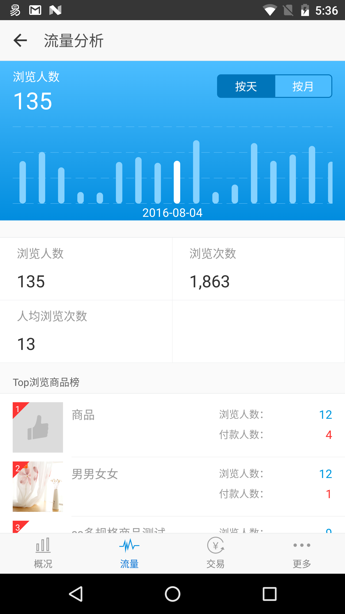
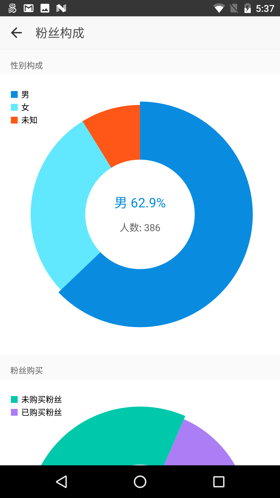
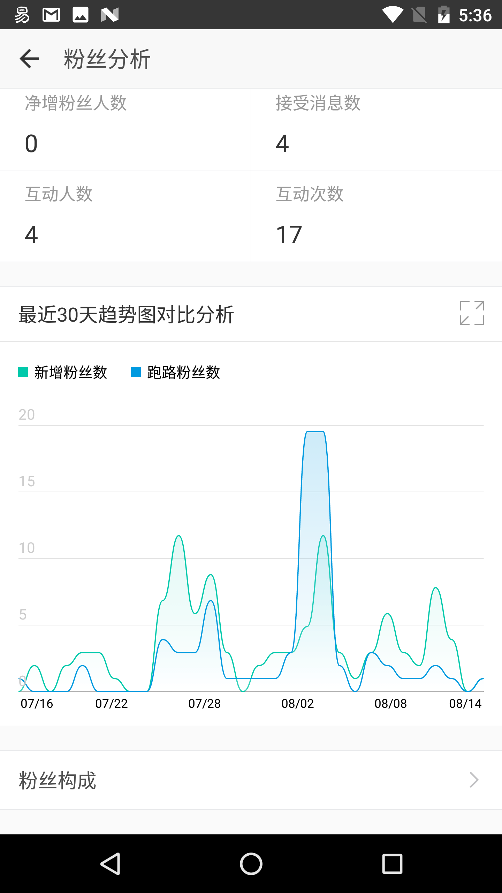
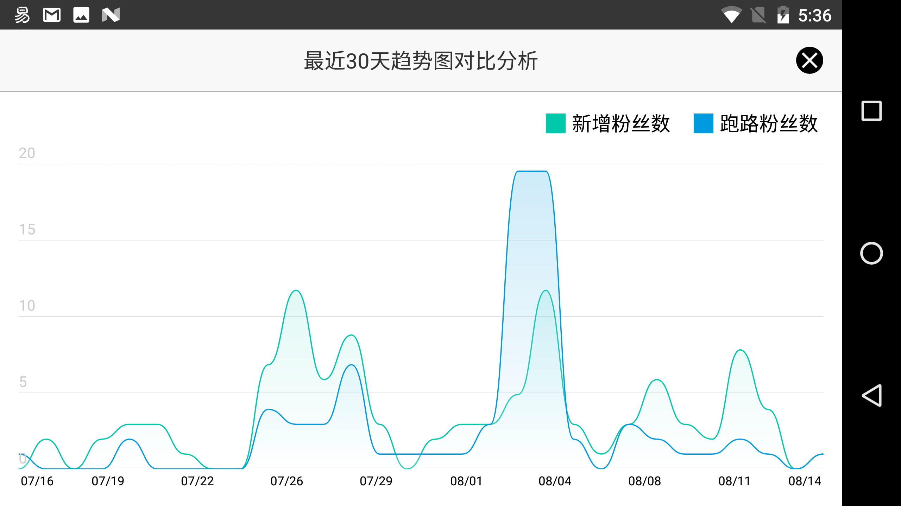

ZanCharts
===

暂时基于 MPAndroidCharts 定制，打算全部重写，目前正在学习源码 - [MPAndroidCharts 源码分析](https://github.com/LyndonChin/wo/tree/master/mpandroicharts)

柱状图
---

* 可拖拽
* 可滑动
* 支持选中动画

## 饼状图
* 可选中
* 支持空数据样式

线状图
---

* 支持填充色渐变
* 横屏支持选中

### 竖屏 

### 横屏

关于
---

[有赞商家版 - 帮助企业建立自己的移动零售商城](https://www.youzan.com/)
